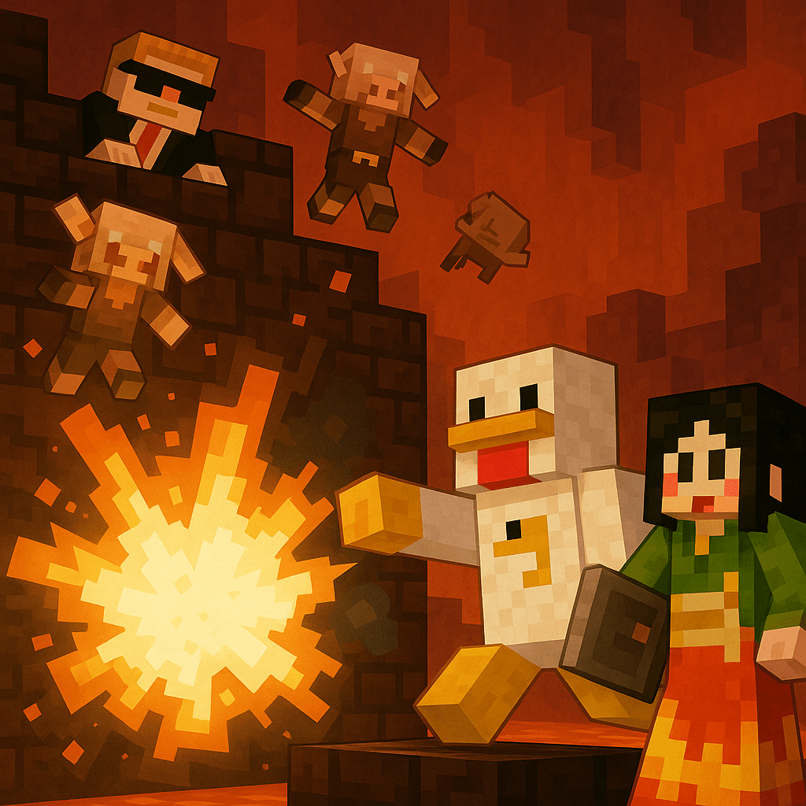

# 雷鳴チキンの 15 分切り大冒険

**_―中年スピードラン“三羽ガラス”奮闘記―_**

## **プロローグ　孤島に響く雄叫び**

〈語り部：あの渋い声でおなじみの某氏〉

その日、**海の孤島**に雷鳴がとどろいた。薄曇りの空から落ちてきた二本の稲妻――否、**中年スピードランナー**ふたりである。

ひとりは **トリさん** 四十代、理屈屋で実験好き。PB（自己ベスト）は **15 分 29 秒**。マグマダイブ癖は治らない。

もうひとりは **オロさん**、同じく四十代。PB **15 分 23 秒** でトリさんより常に **6 秒** 先を行く。努力家だが勝負師の血が騒ぐタイプ。

二人が砂浜で咳きこむ間もなく、遠方からボートが近づく。オールを握る銀髪――**わかとの**さん。来年で大台五十。本日の役割は助っ人兼実況、そして「エンドラ RTA ミドル世代リーグ“しるばーふぁんぐ”」の公式レフェリーである。

> **わかとの**「**制限時間 15 分！　 PB 更新をかけた勝負、よーい…スタートッ！**」

砂が跳ね、ふたりは同時に沖へ飛び込んだ。

## **第一章　トライデントは空を裂く**

最初の目標は **マップレストレジャー**――海底の埋蔵財宝を地図無しで引き当て、鉄と TNT をかき集めること。

しかし孤島周辺はドラウンドだらけ。オロさんが石斧で応戦しつつ、高速で海底をさらう。

一方トリさん、闇雲に殴っていたら**幸運のドロップ**。ドラウンドがトライデントを落とした。

> **トリさん**「**キタコレ！　実験開始ッ！**」

トライデントを空高く投げる瞬間、微かに聞こえる雷鳴――**“トライデント占術”**。その落雷点こそチェストの真上、という理屈（本人談）。

潮の流れとブロック座標を秒で計算、海底をスコップで掘り進める。バリッ！　チェスト発見。中身は鉄インゴット 12、TNT 3、金塊少々、サーモンの切り身。

しかし浮上ミスで酸素バーが尽きる。

> **トリさん**「**ゴボッ！**」

――**初デス**。リスポーン地点は幸い島上。**30 秒**タイムロス。
オロさんも別のチェストを漁って鉄 10 を確保。ここまで互角、だがトリさんのデス一回分で実タイム差 **27 秒**。わかとのさんがストップウォッチを掲げる。

> **わかとの**「**ほらほら、まだ序盤よぉ！**」

## **第二章　マグマ拳（ケン）フィニッシュ**

二人は急ぎ浅瀬に焚火を置き、バケツをクラフト。溶岩源の採取場所を聞き出すと、トリさんは

> **トリさん**「**理屈より勢いだ！**」

と叫び、海溝の最深部へダイブ。

黒曜石を露出させた海底峡谷。設計図なし、座標も測らず、ただ溶岩源を素手でつかんだまま――

> **トリさん**「**マグマァ…拳（ケン）フィニィィッシュ！！**」

**ド   ゴ   ォ   ッ！！**

拳ごと叩き付けられたマグマが黒曜石表面に瞬間蒸発のクラックを走らせ、紫の渦が点火。ゲート完成。痛みで HP 残り 1。

> **わかとの**「**それ人体実験でしょ！　成功だから良し！！**」

オロさんは慎重派、黒曜石 10 枚の“標準枠”を組み、火打石着火。結果は――**ほぼ同時ワープ**。トリさんの 30 秒ロスを帳消しした格好だ。

## **第三章　ロストポークは回り続ける**

ネザー突入直後、赤黒い大空洞。

> **オロさん**「**バスチャン見つけたほうが勝ちだ！**」

空腹メーターが黄色く染まる中、わかとのさんが取り出したのは焼豚ステーキ。

> **わかとの**「**ロストポーク占盤のお時間です！**」

ステーキをネザーラック上でコマのように回す。脂の多い面が蒸発、軽くなった側がピタリと止まった方角には……黒い砦。**バスチャン確定**。

ピグリンを残虐に処理するオロさんを横目に、トリさんは TNT で壁を爆破。金ブロック 20 を確保し、ピグリンへポイポイ。結果、**エンダーパール 17**。

――が、興奮して一匹**殴打**。ピグリン軍団の猛攻にトリさん大慌て。横からわかとのさんが盾でカウンター。しかし TNT を抱えて逃げる途中で**誤設置 → 自爆**。二人まとめて黒煙。

この乱戦でトリさん **2 デス目**。タイムロス **25 秒**。オロさんは手堅くブレイズロッド優先へ向かい始めた。

## **第四章　わかとの絶唱と黒曜石の音叉**

ネザー要塞探しはスプリント勝負。オロさんは気流を読む**“温度勾配レーダー”**を展開。トリさんたちは**黒曜石の音叉**で反撃。

> **わかとの**「行くよ……**とーーーーーのーーーーーー！！**」

肺活量 49 年、腹から絞り出した烈声が赤石層に反射。トリさんは黒曜石棒をカーン！　高調波が遠方のネザーレンガに吸い込まれ、残響がピタリ停止。

> **トリさん**「**あの方向 124 ブロック！**」

ダッシュ。要塞到着はほぼ同着だったが、ここでオロさんがブレイズ spawner を即座に確保、ロッド 7 本を 30 秒で回収。トリさんは火球をパリィし損ね溶岩に転落――**マグマダイブ癖炸裂**。わかとのさんに引き上げられるも、ここで斧破損。

トリさんのカウンターは、残り TNT を火球で誘爆させて spawner 二つを同時破壊、ドロップ計算で**ロッド 8 本**ゲット。が、ロスは否めず、ネザー脱出時点でタイム差は再び **35 秒**。

## **第五章　ニワトリ羽根の羅針盤**

ゲート帰還位置は雪原＋タイガバイオーム境界。真夜中、天空には満天の星。

> **トリさん**「**ここからが理系の真骨頂！**」

背負っていたニワトリ羽根束を一本抜き、火薬と砂糖で帯電させる。羽根は静電気を帯び、ふわり浮いてリング状に旋回。その中心点が**要塞直上**と判定される――という。

オロさんは三角測量式アイスパイで補正、ほぼ同じラインを走る。積雪の上、夜空を裂く二人の白い蒸気。体温低下を我慢しながら、1 キロ超のダッシュ。

途中でわかとのさんが持ってきた焼豚おかわりを投げ渡す。

> **わかとの**「**脂と糖質が脳を回す！　走れ、中年！**」

残りタイムは **4 分 30 秒**。斜面を掘り下げ、丸石の階段を即席で作る。オロさんはシルクタッチシャベルで流れるような階段化。トリさんはラッシュで 1 ブロック掘削ミス → 落下ダメージ。じわり差が開く。

## **第六章　石レンガの味は酸っぱかった**

要塞内部。松明を置きつつ廊下を激走するオロさんの背中が離れていく。

トリさんは

> **トリさん**「**味覚判定だ！**」

と宣言、石レンガ壁を舐めまくる。

> **トリさん**「ここは甘い…アルカリ方向……おっと酸っぱい！　**pH 5.7**、ポータル部屋付近だ！」

狂気じみた行動にわかとのさんが距離を取りつつも、的中率は高い。3 回目の舐めでシルバーフィッシュの巣に当たり、壁が崩れ落ちてポータル部屋へ転落。その真下でオロさんがアイをはめている最中だった。

> **オロさん**「**間に合ったか、トリ！　でも 6 秒の差は埋まらんぞ？**」

> **トリさん**「**6 秒くらい、ベッド一発で逆転だ！**」

ポータル枠は **10 眼**すでに点灯。二人が同時にエンドへジャンプ。残りタイム **1 分 05 秒**。

## **第七章　量子ヒツジは眠らない**

エンド島の中心でドラゴンが旋回。トリさん、オロさん、わかとのさん、それぞれベッドを抱えてクリスタル無視型近接戦へ。

> **トリさん**「**わかとのさん、羊を起こしてくれ！**」

> **わかとの**「**“寝返り”ね、了解！**」

孤島の羊たち 20 匹。わかとのさんが麦束を振ると、一斉にゴロン。**量子もつれ**が発動し、エンド島に置かれたベッドフレームが紫の粒子をまといはじめる。

オロさんはドラゴン着地を待ち、首元へベッド置き → 即爆破。ドガーン！　残り体力ゲージ 60 ％。

トリさんも続く。角度を測り、マグマ拳でベッドを固定――しかし焦りで 1 ブロック手前。

> **わかとの**「**トリさん、距離ッ！！**」

時すでに遅し。ベッドはトリさんの鼻先で爆裂。

**バ   ン   ッ！！**

HP 消し飛び、死因：**過睡爆発**。画面は真っ暗。リスポーン地点を訊くメッセージ――**\[Respawn\]** をクリック。

……目に映ったのは、あの海の孤島の夜明けだった。

## **エピローグ　初期リスポーンにて**

〈語り部〉

――そしてエンドでは、最後の一撃を決めるオロさんの姿。

**タイム 14 分 54 秒**。 PB を **2 秒更新**。トリさんとの差、わずか **“ベッド一発未満”**。

孤島の浜辺、朝日が昇る。

トリさんは砂に倒れ込み、額の汗をこすりながら笑った。

> **トリさん**「……あー、やっちまった。**ベッド一個で人生変わるんだな**」

わかとのさんがボートで戻り、タオルを投げる。

> **わかとの**「**次は私も参戦して“三つ巴”ね。中年の底力、見せつけましょ！**」

遠くエンドゲート上空に、ドラゴン討伐の光柱が立つ。

> **トリさん**「**6 秒差、いや 8 秒差か。次こそ——理屈と根性で倍返しだ！**」

〈語り部〉

こうして“しるばーふぁんぐ孤島決戦”は幕を閉じた。しかし中年ランナーたちの闘志は、ベッドの爆発ごときでは鎮火しない。

次回――**“マグマ拳改・超臨界編”**。果たして彼らは 14 分台の深淵をどこまで掘り下げるのか？　乞うご期待！
